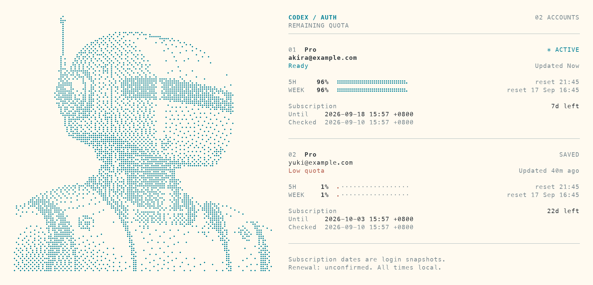

# Codex Auth

`codex-auth` is a command-line tool for switching Codex accounts.

## This fork: halftone dashboard, subscription dates and reset news

The default `fork-main` branch is based on upstream **v0.2.10**. The original
upstream `main` remains available separately. `codex-auth list` pairs a detailed
retro space-exploration robot with an uncluttered account dashboard.
The illustration uses cyan Braille halftone dots: eight dots per character, up to a **128 x 128 dot**
portrait. Quota bars use the same dot style.



The preview is rendered from captured terminal output with fictional accounts.
The CLI inherits your terminal's background; Braille dot shapes depend on its font.

- Wide terminals place the portrait beside the accounts; narrow terminals stack
  it above them. Six embedded resolutions adapt to widths from 24 to 160 columns.
- Thin rules, aligned metadata, percentage-first quota rows, and restrained teal
  accents keep the information readable beside the artwork. Warning colors apply
  to status and filled dots; reset times and secondary details stay muted.
- The `* ACTIVE` account appears first, retaining its original number so that
  the numbers still match the switch/remove selectors. Other accounts retain
  their relative order, and workspace labels remain visible.
- Quota reset labels show a countdown such as `resets in 2d 4h` or
  `resets in 35m`, calculated when the command runs. Past reset times show
  `window reset`; unavailable times remain `reset unknown`.
- Compact `SUB` and `Checked` rows retain the full local subscription snapshot
  timestamps and UTC offsets. The status caption changes with remaining quota
  or refresh errors; the portrait is static.
- Percentages and filled dots show **remaining** quota. Unknown or failed usage
  uses question marks instead of looking like zero quota. The fine dotted bars
  have quarter-cell precision and keep a visible mark for nonzero quota.
- `NO_COLOR` disables ANSI colors while keeping the illustration. `TERM=dumb`
  gives a plain account list without the portrait or Braille bars. Piped output
  has no ANSI escapes; its default layout uses up to 128 columns.
- The original generated portrait and its precomputed text assets are included.
  Regenerate them with `python3 scripts/generate_portrait.py` (Pillow required
  only for asset generation). The CLI needs no Python, image protocol, downloads,
  or additional network requests to display the artwork.

`SUB` shows remaining full days alongside the last-known
**valid-until** time, and `Checked` shows the subscription's **last-checked** time. Dates use the local
timezone and include the UTC offset. This also works with `list --skip-api`.

The dates come from `chatgpt_subscription_active_until` and
`chatgpt_subscription_last_checked` in each account's saved ID token. They do
not use the token's `exp` field or usage reset times. No additional API request,
token refresh, or registry migration is needed for this feature.

- Missing, malformed, or unavailable dates are shown as `unknown`.
- A date in the past is labeled `past snapshot`, not proof that billing expired.
- Automatic renewal and the next charge date cannot be determined from these
  claims. A renewed subscription may require a fresh login to update its snapshot.

### Reset news and system notifications

```shell
codex-auth resets                        # latest, scheduled and forecast information
codex-auth resets --cached               # offline snapshot
codex-auth resets --json                 # structured data and cache freshness
codex-auth resets notify enable          # macOS: background checks, also after login
codex-auth resets notify status          # service, last check and errors
codex-auth resets notify test            # send an explicitly labeled test notification
codex-auth resets notify disable         # remove the background job
codex-auth resets watch                  # foreground notifications (macOS / Linux)
```

The [Codex Resets public API](https://codex-resets.com/api/docs) supplies reset
announcements. `resets` distinguishes regular usage resets, banked reset-credit
announcements, pending scheduled resets, and **AI forecasts**. A passed scheduled
time does not imply execution. Public announcements do not establish your
account's eligibility or personal credit balance.

- The first successful notification check saves a quiet baseline. New executed
  announcements, scheduled announcements, and new or strengthened forecasts
  notify once. A scheduled announcement later reported as executed notifies
  again. Changing feed generation timestamps, percentages or wording alone does
  not produce another notification. Expired forecasts do not notify.
- Checks run every **5 minutes** while the computer is awake and the user is
  signed in. The client revalidates using `ETag` / `If-None-Match`, honors
  `Retry-After`, and backs off on network errors. Offline output explicitly labels
  its cached snapshot. This is polling of current status, not a real-time stream;
  intermediate announcements during a long offline period may not be replayed.
- macOS background checks use a separate per-`CODEX_HOME` LaunchAgent. No terminal
  needs to remain open. Linux supports foreground `watch` with `notify-send`;
  automatic background installation currently supports macOS only. Viewing news
  works on all supported platforms with Node.js 22+.
- State and notification history live in `CODEX_HOME/reset-news/state.json`.
  Fetches use no account credentials. The monitor does not read authentication
  files, modify the account registry, switch accounts, or consume reset credits.
- Notifications use macOS `osascript` (Script Editor notifications) or Linux
  `notify-send`. If the test command succeeds but no banner appears, allow the
  relevant app in system notification settings and check Focus / Do Not Disturb.
  OS acceptance of a notification does not prove it was displayed.
- The job retains the Node executable, `PATH`, and proxy environment from the
  terminal where it was enabled. With the existing wrapper, it keeps using
  `http://127.0.0.1:7890`. Re-run `notify enable` after changing the executable or
  proxy. Native environment proxy support needs Node.js 22.21+ or 24+.
- `list --skip-api` remains entirely independent of the public feed. Use `resets`
  to view public announcements; `resets check` performs one enabled monitor check.

For development, run `zig test src/main.zig -lc`, `zig build`, and
`node --test tests/*.test.mjs`. Reset tests use synthetic API responses, isolated
state, and fake notification delivery; they never contact your accounts.

The upstream npm package below does **not** include this fork's changes. To build
this branch with Zig **0.15.1**:

```shell
zig build -Doptimize=ReleaseSafe
./zig-out/bin/codex-auth list --skip-api
```

If Zig 0.15.1 cannot link against a recent Xcode SDK, use the installed Command
Line Tools SDK for that build (this does not change the system Xcode selection):

```shell
DEVELOPER_DIR=/Library/Developer/CommandLineTools zig build -Dtarget=aarch64-macos.15.0 -Doptimize=ReleaseSafe
```


> [!IMPORTANT]
> For **Codex CLI** and **Codex App** users, switch accounts, then restart the client for the new account to take effect.
>
> If you use the CLI and want seamless automatic account switching without restarting, use the forked [`codext`](https://github.com/Loongphy/codext), an enhanced Codex CLI. Install it with `npm i -g @loongphy/codext` and run `codext`.

## Supported Platforms

`codex-auth` works with these Codex clients:

- Codex CLI
- VS Code extension
- Codex App

For the best experience, install the Codex CLI even if you mainly use the VS Code extension or the App, because it makes adding accounts easier:

```shell
npm install -g @openai/codex
```

After that, you can use `codex login`, `codex login --device-auth`, `codex-auth login`, or `codex-auth login --device-auth` to sign in and add accounts more easily.

## Install

Install with npm:

```shell
npm install -g @loongphy/codex-auth
```

  You can also run it without a global install:

```shell
npx @loongphy/codex-auth list
```

  npm packages currently support Linux x64, Linux arm64, macOS x64, macOS arm64, Windows x64, and Windows arm64.

### Uninstall

#### npm

Remove the npm package:

```shell
npm uninstall -g @loongphy/codex-auth
```

#### Legacy Bash Installer

> [!NOTE]
> If you only installed `@loongphy/codex-auth` with npm, you do not need any legacy cleanup steps.
> Older Bash/PowerShell GitHub-release installs could leave a standalone `codex-auth` binary outside npm's install path.
> If you previously used those legacy installers, remove the leftover binaries and profile changes during migration.
> API-backed usage refresh and team-name refresh use Node.js `fetch`.
> npm installs already satisfy that requirement.

For non-npm installs on Linux/macOS/WSL2 only:

```shell
rm -f ~/.local/bin/codex-auth
rm -f ~/.local/bin/codex-auth-auto
sed -i '/# Added by codex-auth installer/,+1d' ~/.bashrc ~/.bash_profile ~/.profile ~/.zshrc ~/.zprofile 2>/dev/null || true
```

If you used fish, also remove the old profile entry:

```shell
sed -i '/# Added by codex-auth installer/,+3d' ~/.config/fish/config.fish 2>/dev/null || true
```

#### Legacy PowerShell Installer

For non-npm installs on Windows only:

```powershell
Remove-Item "$env:LOCALAPPDATA\codex-auth\bin\codex-auth.exe" -Force -ErrorAction SilentlyContinue
Remove-Item "$env:LOCALAPPDATA\codex-auth\bin\codex-auth-auto.exe" -Force -ErrorAction SilentlyContinue
[Environment]::SetEnvironmentVariable(
  "Path",
  (($env:Path -split ';' | Where-Object { $_ -and $_ -ne "$env:LOCALAPPDATA\codex-auth\bin" }) -join ';'),
  "User"
)
```

## Commands

### Account Management

| Command | Description |
|---------|-------------|
| `codex-auth list [--debug]` | List all accounts |
| `codex-auth login [--device-auth]` | Run `codex login` (optionally with `--device-auth`), then add the current account |
| `codex-auth switch [<email>]` | Switch active account interactively or by partial match |
| `codex-auth remove` | Remove accounts with interactive multi-select |
| `codex-auth status` | Show auto-switch, service, and usage status |

### Import

| Command | Description |
|---------|-------------|
| `codex-auth import <path> [--alias <alias>]` | Import a single file or batch import from a folder |
| `codex-auth import --cpa [<path>]` | Import [CLIProxyAPI](https://github.com/router-for-me/CLIProxyAPI) (CPA) token JSON |
| `codex-auth import --purge [<path>]` | Rebuild `registry.json` from existing auth files |

### Configuration

| Command | Description |
|---------|-------------|
| `codex-auth config auto enable\|disable` | Enable or disable experimental background auto-switching |
| `codex-auth config auto [--5h <%>] [--weekly <%>]` | Set experimental auto-switch thresholds |
| `codex-auth config api enable\|disable` | Enable or disable both usage refresh and team name refresh API calls |

---

## Examples

### List Accounts

> [!IMPORTANT]
> Built-in Node proxy support for API refresh requires Node.js `22.21.0+` or `24.0.0+`.

```shell
codex-auth list
codex-auth list --debug
```

### Switch Account

Interactive: shows email, 5h, weekly, and last activity.

```shell
codex-auth switch
```


Non-interactive: fuzzy match by email or alias.

```shell
codex-auth switch john             # match any account containing "john"
codex-auth switch john@gmail.com   # match by full or partial email
codex-auth switch work             # match by alias set during import
```

If the keyword matches multiple accounts, the command falls back to interactive selection. Press `q` to quit without switching.

### Remove Accounts

```shell
codex-auth remove
```

### Login (Add Account)

Add the currently logged-in Codex account:

```shell
codex-auth login
codex-auth login --device-auth
```

### Import

#### Single File

```shell
codex-auth import /path/to/auth.json --alias personal
```

#### Batch Import from a Folder

Scans all `.json` files in the directory:

```shell
codex-auth import /path/to/auth-exports
```

Typical output:

```text
Scanning /path/to/auth-exports...
  ✓ imported  token_ryan.taylor.alpha@email.com
  ✓ updated   token_jane.smith.alpha@email.com
  ✗ skipped   token_invalid: MalformedJson
Import Summary: 1 imported, 1 updated, 1 skipped (total 3 files)
```

`stdout` carries scanning, success, and summary lines. Skipped files and warnings stay on `stderr`.

#### Import CLIProxyAPI (CPA) Tokens

[CLIProxyAPI](https://github.com/router-for-me/CLIProxyAPI) stores tokens as flat JSON under `~/.cli-proxy-api/`. Import them directly without conversion:

```shell
codex-auth import --cpa                                  # scan default ~/.cli-proxy-api/*.json
codex-auth import --cpa /path/to/cpa-dir                 # scan a specific directory
codex-auth import --cpa /path/to/token.json --alias bob  # import a single CPA file
```

#### Fix Broken Account Data (Rebuild Registry)

If `codex-auth list` shows missing accounts or wrong usage data, the internal registry file may be out of sync with the actual auth files on disk. This command re-reads all auth files and rebuilds the registry from scratch:

```shell
codex-auth import --purge                                # rebuild from ~/.codex/accounts/*.auth.json
codex-auth import --purge /path/to/auth-exports          # rebuild from a specific folder
```

This does not import new files. It repairs the registry index for auth snapshots that already exist on disk.

### Show Status

```shell
codex-auth status
```

### Config

#### Auto-Switch

> [!WARNING]
> Auto-switch is experimental. Behavior, defaults, and platform integration may change in future releases while the feature matures.

Enable or disable:

```shell
codex-auth config auto enable
codex-auth config auto disable
```

`config auto enable` prints the current usage mode after installing the watcher, so you can immediately see whether auto-switch is running with default API-backed usage or local-only fallback semantics.

Adjust thresholds:

```shell
codex-auth config auto --5h 12
codex-auth config auto --5h 12 --weekly 8
codex-auth config auto --weekly 8
```

When auto-switching is enabled, a long-running background watcher refreshes the active account's usage and silently switches accounts when:

- 5h remaining drops below the configured 5h threshold (default `10%`), or
- weekly remaining drops below the configured weekly threshold (default `5%`)

The managed background worker is long-running on all supported platforms:

- Linux/WSL: persistent `systemd --user` service
- macOS: `LaunchAgent`
- Windows: scheduled task that launches the long-running helper at logon, restarts it after failures, has no 72-hour execution cap, and also starts it immediately on enable

#### Usage Refresh Source

API-backed fallback:

```shell
codex-auth config api enable
```

Local-only, no usage API calls:

```shell
codex-auth config api disable
```

Changing `config api` updates `registry.json` immediately. `api enable` is shown as API mode and `api disable` is shown as local mode.

## Q&A

### Why is my usage limit not refreshing?

If `codex-auth` is using local-only usage refresh, it reads the newest `~/.codex/sessions/**/rollout-*.jsonl` file. Recent Codex builds often write `token_count` events with `rate_limits: null`. The local files may still contain older usable usage limit data, but in practice they can lag by several hours, so local-only refresh may show a usage limit snapshot from hours ago instead of your latest state.

- Upstream Codex issue: [openai/codex#14880](https://github.com/openai/codex/issues/14880)

You can switch usage limit refresh to the usage API with:

```shell
codex-auth config api enable
```

Then confirm the current mode with:

```shell
codex-auth status
```

`status` should show `usage: api`.

Upgrade notes:

- If you are upgrading from `v0.1.x` to the latest `v0.2.x`, API usage refresh is enabled by default.
- If you previously used an early `v0.2` prerelease/test build and `status` still shows `usage: local`, run `codex-auth config api enable` once to switch back to API mode.

Verify with:

```shell
codex exec "say hello"
```

## Disclaimer

This project is provided as-is and use is at your own risk.

**Usage Data Refresh Source:**
`codex-auth` supports two sources for refreshing account usage/usage limit information:

1. **API (default):** When `config api enable` is on, the tool makes direct HTTPS requests to OpenAI's endpoints using your account's access token. This enables both usage refresh and team name refresh. npm installs already satisfy the runtime requirement; legacy standalone binary installs need Node.js 22+ on `PATH`.
2. **Local-only:** When `config api disable` is on, the tool scans local `~/.codex/sessions/*/rollout-*.jsonl` files for usage data and skips team name refresh API calls. This mode is safer, but it can be less accurate because recent Codex rollout files often contain `rate_limits: null`, so the latest local usage limit data may lag by several hours.

**API Call Declaration:**
By enabling API(`codex-auth config api enable`), this tool will send your ChatGPT access token to OpenAI's servers, including `https://chatgpt.com/backend-api/wham/usage` for usage limit and `https://chatgpt.com/backend-api/accounts/check/v4-2023-04-27` for team name. This behavior may be detected by OpenAI and could violate their terms of service, potentially leading to account suspension or other risks. The decision to use this feature and any resulting consequences are entirely yours.
